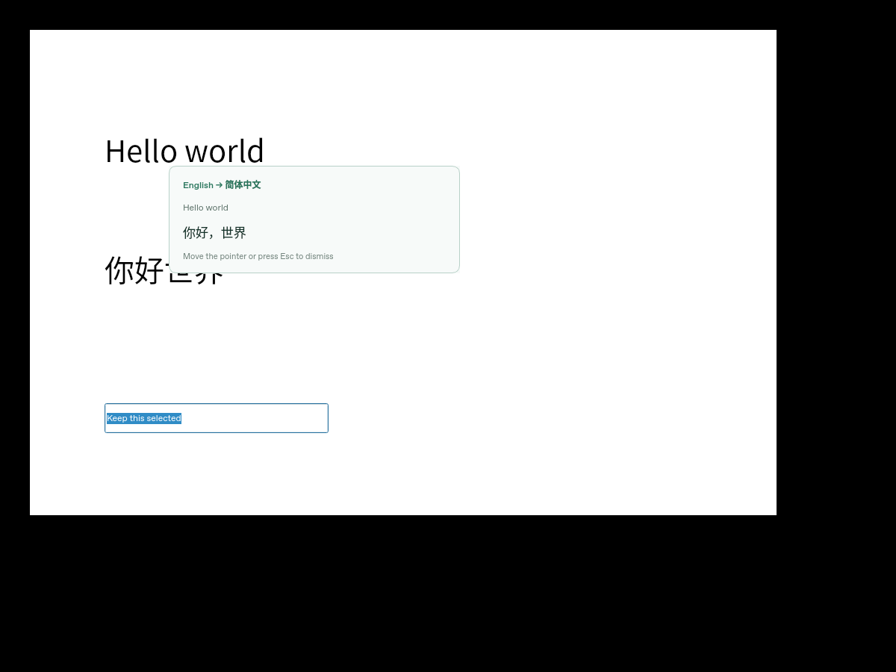
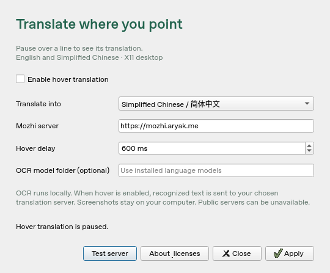

# Hover Translate

[English](README.md) · [简体中文](README.zh-CN.md)

An open-source Linux mouse-hover translator for **English ↔ Simplified
Chinese**, based on the OCR and translation components of Crow Translate 4.1.0.
Licensed under **GPL-3.0-or-later**; see [LICENSE](LICENSE),
[NOTICE.md](NOTICE.md) and [upstream provenance](docs/UPSTREAM.md).

Pause the pointer over text for 600 ms. The app reads the nearby line with
local Tesseract OCR and shows its translation in a small popup. It does not
copy selections, change the clipboard or focus the popup. Moving the pointer
or pressing Escape dismisses it. Requests from an older hover are canceled.

## Preview



The preview comes from the real X11/OCR integration test. Its translation
response is supplied by a local Mozhi-compatible test server.



## Features

- Local OCR of the line under the pointer, with a configurable 100–3000 ms delay.
- A saved target language: English or Simplified Chinese.
- A popup that preserves focus, selections, and the clipboard.
- Dismissal by pointer movement or Escape; pause and settings controls.
- Cancellation of outdated OCR/translation jobs, a 10-second server timeout,
  and a bounded in-memory translation cache.
- GUI and headless command-line diagnostics, plus real OCR/X11 tests.

## Supported desktop

- X11/Xorg, one monitor, 100% scaling.
- English and Simplified Chinese text; one fixed target chosen in settings.
- Tesseract 5 with `eng` and `chi_sim` models.
- Qt 6.8 or newer; Debian 13 amd64 is the tested build platform.
- A reachable Mozhi server with its Google engine enabled.

Native Wayland, multiple monitors, fractional scaling, accessibility-based text
extraction and offline translation are outside this first version. OCR can miss
small, stylized or low-contrast text. It captures a region up to 700 × 160 pixels,
clipped to the window under the pointer; long lines can be truncated. Source
language detection uses Latin/Han characters and is intended for these two
languages, rather than general language identification.

## Install a Debian 13 package

Download a binary and its matching source from a published
[release](https://github.com/LincolnGothic/Linux_mouse_hover_translation/releases),
when available. Install the Debian 13 amd64 package with its system dependencies:

```bash
sudo apt-get install ./hover-translate_0.1.0_amd64.deb
hover-translate
```

The matching source archive is `hover-translate-0.1.0-Source.tar.gz`. Keep it
available to recipients when sharing the binary; see [release instructions](docs/RELEASE.md).

## Build and run on Debian 13

```bash
git clone https://github.com/LincolnGothic/Linux_mouse_hover_translation.git
cd Linux_mouse_hover_translation
sudo apt-get update
sudo apt-get install build-essential cmake ninja-build pkg-config \
  qt6-base-dev qt6-base-dev-tools qt6-scxml-dev qt6-svg-plugins \
  libtesseract-dev libleptonica-dev libxcb1-dev \
  tesseract-ocr-eng tesseract-ocr-chi-sim fonts-noto-cjk
cmake -S . -B build -G Ninja -DCMAKE_BUILD_TYPE=RelWithDebInfo -DBUILD_TESTING=OFF
cmake --build build --parallel 4
./build/hover-translate
```

Choose **Translate into**, check **Enable hover translation**, and click
**Apply**. Use **Test server** to send the sample word “Hello” before hovering
over your own text. The initial setting is paused. Settings are saved in
`~/.config/LincolnGothic/HoverTranslate/settings.ini` by default.

On desktops with a system tray, closing settings leaves the tray controls
available. On desktops without a tray, keep settings open while using hover;
closing them quits the app. `--background` starts in the tray when one exists.

The default server is `https://mozhi.aryak.me`; public instances can be down,
blocked or rate-limited. Enter another Mozhi **HTTPS** server if necessary.
Plain HTTP is accepted only for a server on localhost. The URL must not contain
credentials, a query or a fragment. This version does not use API keys.

## Privacy and online services

Screenshots and OCR stay on your computer. When enabled, recognized text from
the line under the pointer is sent to your configured Mozhi server, which may
forward it to Google. Do not enable automatic hover over sensitive material
unless you trust the configured services. Server operators control their
logging, availability and terms. The app keeps up to 128 translations in
memory, clears that cache when settings change, and does not save a text history.

## Tests and cloud development

For the real X11/OCR integration tests, install these additional packages:

```bash
sudo apt-get install libxcb-xtest0-dev xvfb xauth x11-utils
cmake -S . -B build -G Ninja -DBUILD_TESTING=ON
cmake --build build --parallel 4
xvfb-run -a -s '-screen 0 1200x900x24' ctest --test-dir build --output-on-failure
```

The suite renders English and Chinese text in a real X11 window, captures it,
runs the real Tesseract models, uses Crow's actual HTTP translator against a
local Mozhi-compatible fixture, and checks popup dismissal, stale requests,
cache behavior, focus, selection and clipboard preservation. It also tests
settings, missing models, timeouts, malformed replies and the built CLI.
Local server fixtures do not establish public-server availability.

The selected cloud image allows workspace writes but not system package
installation. A rootless SDK helper uses Debian's signed repository without
changing `/etc` or disabling verification:

```bash
cd /workspace/Linux_mouse_hover_translation
bash tools/bootstrap-cloud.sh
source tools/activate-cloud.sh
cmake -S . -B build -G Ninja -DCMAKE_BUILD_TYPE=RelWithDebInfo -DBUILD_TESTING=ON
cmake --build build --parallel 4
xvfb-run -a -s '-screen 0 1200x900x24' ctest --test-dir build --output-on-failure
```

The SDK is retained at `/workspace/.hover-translation-tools`; source the
activation script in each new shell. Xvfb is a temporary test display. Running
the hover GUI for everyday use requires an actual supported desktop session.
Cloud access to the public Mozhi server additionally requires that hostname
in the environment's network settings.

## Command-line diagnostics

```bash
./build/hover-translate --help
./build/hover-translate --ocr image.png
./build/hover-translate --translate 'Hello world' --target zh-CN
./build/hover-translate --translate '你好世界' --target en --instance https://your-mozhi-host
./build/hover-translate --config /tmp/hover-settings.ini --paused
```

OCR prints UTF-8 JSON with text, confidence and line coordinates. OCR,
translation, help and version commands work without a display. Translation
uses the same server and language validation as the GUI, with a 10-second
request timeout. You can set `TESSDATA_PREFIX` or the optional OCR model folder
if your models are installed somewhere else.

## Sharing modifications

The derivative retains Crow's original copyright and license notices and
marks modified imported files. Keep those notices with your changes. If you
distribute binaries, provide recipients the complete corresponding source
under GPL-3.0-or-later. Private use without distribution does not itself require
public publication. See [release instructions](docs/RELEASE.md) for packaging,
source archives and dependency notices.

## Documentation and contributions

- [简体中文说明](README.zh-CN.md)
- [Contributing and development](CONTRIBUTING.md)
- [Version history](CHANGELOG.md)
- [Validation and known limits](docs/TESTING.md)
- [Release and corresponding-source requirements](docs/RELEASE.md)
- [Copyright and dependency notices](NOTICE.md)
- [Pinned Crow upstream and modifications](docs/UPSTREAM.md)

Report bugs and feature requests in
[GitHub Issues](https://github.com/LincolnGothic/Linux_mouse_hover_translation/issues).
Include your desktop session, scaling, Qt/Tesseract versions, and steps to
reproduce. Use sample text; screenshots and logs may contain private material.
