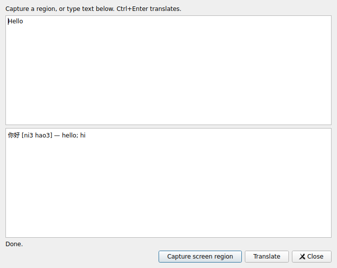

# Hover Translate

[English](README.md) · [简体中文](README.zh-CN.md)

Open-source **English ↔ Simplified Chinese** translation for Linux. Version
0.2.0 defaults to local Argos translation, with optional CC-CEDICT word
definitions. Download the runtime and models once; translation then needs no
API key or online service. Licensed under **GPL-3.0-or-later**, with preserved
[Crow Translate notices](NOTICE.md) and [upstream provenance](docs/UPSTREAM.md).

## Ubuntu 26.04: install and start

Use the **Ubuntu 26.04 amd64** package and its matching source archive:

[Download release assets](https://github.com/LincolnGothic/Linux_mouse_hover_translation/releases).

```bash
sudo apt install ./hover-translate_0.2.0_amd64.deb
hover-translate
```

In Settings, keep **Translation → Offline**, click **Install offline models**,
and wait for the one-time download to finish. This installs a private Python
environment, CPU PyTorch, Argos Translate 1.11.0, and English/Chinese models
1.9 under `~/.local/share/hover-translate`. System Python is left intact.
The optional CC-CEDICT download supplies word definitions. Setup requires
internet access and storage for the runtime and models.

Click **Test translation**, then choose **Translate text** or **Translate
screen region**. Set the target to English for Chinese → English, or Simplified
Chinese for English → Chinese. The first sentence request loads its model;
later requests reuse it while the reader remains open. Translation quality
depends on the model and OCR quality; review important translations.

For setup errors, run the same installer in a terminal:

```bash
hover-translate-offline-setup
```

Detailed instructions: [Ubuntu 26.04 guide](docs/UBUNTU-26.04.md). The earlier
v0.1.0 public release does not contain these offline or screen-region features.




These are captures from GUI integration tests. The reader uses a small
test-authored dictionary; it does not demonstrate real sentence-model quality.

## Desktop workflows

| Mode | Desktop | Interaction |
| --- | --- | --- |
| Screen region | Wayland or X11, with a screenshot portal/backend | Choose a screenshot, drag around text in the preview, then read the result |
| Typed text | Wayland or X11 | Enter text and press Ctrl+Enter |
| Automatic hover | X11/Xorg, one display at 100% scaling | Enable hover, apply settings, and pause the pointer over a line |

On Wayland, automatic hover is disabled in Settings. Screen-region capture
uses the screenshot portal and your desktop's permission dialog. Some portal
backends let you choose a region, while others return a whole screenshot.
The local preview lets you select text in either case. Press Enter to process
the entire preview, or Escape to cancel. The app does not change the clipboard.

Add a desktop keyboard shortcut for `hover-translate --capture`.
This version does **not** provide automatic hover across native Wayland apps.
Native client integration is tested with a Wayland compositor and a local
portal fixture; the actual GNOME permission flow needs verification on your
desktop. See [validation and limits](docs/TESTING.md).

X11 hover captures up to 700 × 160 pixels inside the window under the pointer.
Its popup preserves focus, selections and the clipboard; movement or Escape
dismisses it. Small, stylized or low-contrast fonts and long lines can impair
OCR. The bounded in-memory cache and stale-request cancellation prevent older
results from replacing newer requests. Offline requests have a 120-second
limit; online requests have a 10-second limit.

## Dictionaries and privacy

CC-CEDICT is primarily Chinese → English. Exact searches of English definitions
also return Chinese entries, but are **not** a comprehensive English → Chinese
dictionary. Text without a matching entry uses Argos sentence translation.
Uncheck **Show dictionary definitions** to use the model for every translation.
Settings can point at your own CC-CEDICT `.u8` file.

The offline worker disables network connections, including implicit model
downloads. Only the separate setup tool downloads resources. OCR and
translation run on your computer. The app does not save text history or modify
the clipboard. The desktop portal manages temporary screenshots. Downloaded
dictionary/model/runtime notices are retained; these assets are not bundled
in the application installer or source archive.

**Online → Mozhi** remains an explicit option and sends recognized text to your
selected server, which may forward it to Google. Public instances can fail or
be rate-limited. Offline errors never fall back to an online provider.

Settings are saved in `~/.config/LincolnGothic/HoverTranslate/settings.ini`.
With a system tray, closing Settings leaves tray controls available. Without
a tray, keep a Settings or reader window open.

## Build from source

Ubuntu 26.04 or Debian 13, with Qt 6.8+:

```bash
sudo apt update
sudo apt install build-essential cmake ninja-build pkg-config \
  qt6-base-dev qt6-base-dev-tools qt6-scxml-dev qt6-svg-plugins qt6-wayland \
  libtesseract-dev libleptonica-dev libxcb1-dev \
  tesseract-ocr-eng tesseract-ocr-chi-sim fonts-noto-cjk \
  python3-venv xdg-desktop-portal
cmake -S . -B build -G Ninja -DCMAKE_BUILD_TYPE=RelWithDebInfo -DBUILD_TESTING=OFF
cmake --build build --parallel 3
python3 offline/setup_offline.py
./build/hover-translate
```

Install your desktop's portal backend (GNOME: `xdg-desktop-portal-gnome`).
Build assets are copied beside the executable; installed assets live in
`/usr/share/hover-translate`.

## Tests and cloud development

```bash
sudo apt install libxcb-xtest0-dev xvfb xauth x11-utils dbus-x11 weston
cmake -S . -B build -G Ninja -DBUILD_TESTING=ON
cmake --build build --parallel 3
dbus-run-session -- xvfb-run -a -s '-screen 0 1200x900x24' \
  ctest --test-dir build --output-on-failure
bash tools/test-wayland.sh build
```

Tests use real Tesseract OCR, X11 hover, Python dictionary lookup and the
screenshot portal protocol through a local fixture. They verify cropping,
cancellation, timeout/error handling and clipboard preservation. Online tests
use a local server fixture. These checks do not establish model translation
quality or actual GNOME portal behavior.

For the rootless Debian cloud SDK, run `bash tools/bootstrap-cloud.sh`, then
source `tools/activate-cloud.sh` in each shell. Dependencies live outside the
checkout at `/workspace/.hover-translation-tools`. Native Ubuntu packaging
uses an Ubuntu 26.04 environment with installed system libraries; CPack computes
dependencies with `dpkg-shlibdeps`. Cloud model downloads need `argos-net.com`;
the optional dictionary needs `www.mdbg.net`.
For a repeatable Linux/Docker build, use `bash tools/build-ubuntu26.04.sh`.
Add `--model-check` to require real sentence-model checks before packaging.

## Command-line tools

```bash
hover-translate --capture
hover-translate --reader
hover-translate --ocr image.png
hover-translate --translate 'Hello world' --target zh-CN --no-dictionary
hover-translate --translate '你好世界' --target en --no-dictionary
hover-translate --translate '你好' --target en
```

OCR, translation, help and version commands work without a display.
`--python`, `--models-dir` and `--dictionary` override offline paths.
`--provider mozhi --instance https://your-mozhi-host` enables online translation;
`--instance` alone also selects Mozhi for compatibility with 0.1.0.
`--provider offline` always takes precedence.

## Sharing and contributing

Keep the GPL, copyright notices and marked Crow modifications. When sharing
the binary, provide its complete corresponding source, including build and
installation scripts. The matching archive is `hover-translate-0.2.0-Source.tar.gz`;
see [release instructions](docs/RELEASE.md). Redistributed dictionaries and
models have their own license obligations.

- [简体中文说明](README.zh-CN.md)
- [Contributing](CONTRIBUTING.md)
- [Changelog](CHANGELOG.md)
- [Validation](docs/TESTING.md)
- [Notices](NOTICE.md)
